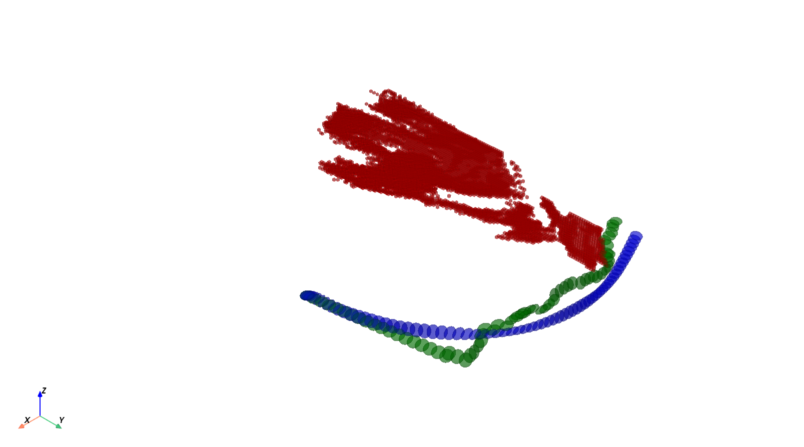

# Optimal Trajectory generation for non convex represention of the enviroment

In this folder we compute an optimal trajectory considering the dynamics of the
robot used as well as considering the full volume of the robot, meaning we don't
apply a point mass reduction to the robot for a non convex environemnt.

The requirments necessary to used this module are:
- Having a representation of the environment that is compatible with conversion
to the [octomap](https://octomap.github.io/) format (i.e. .pcd / .bt /.ot).
- A Convex representation of the robot with a defined [support
function](https://en.wikipedia.org/wiki/Support_function), since this will be
required in the optimization phase.
- A representation of the robot that is compatible with the the
[python-fcl](https://github.com/BerkeleyAutomation/python-fcl) library for
colision avoidance.

## Path Generation

Before the generation of an optimal trajectory we first generate a path going
from the start state of the robot to the end state, a cinematic RRT is employed
that uses a flexible collision library for detection of collision between the
environment and robot. This step does not consider the dynamics of the robot,
since it is not necessary due to the robot being a holomonic vehicle, meaning we
are not subject to unfeasible path.

The state of the RRT is only composed by the position and attitude of the robot,
meaning we don't consider velocity (both linear and angular), and the validity
of the state is check by ensuring the number of collisions between the robot and
any other member of the environment is stricly zero. To ensure the path from one
state to the other is collisions free, we use a [cubic
spline](https://docs.scipy.org/doc/scipy/reference/generated/scipy.interpolate.CubicSpline.html)
for the position variation and
[SLERP](https://docs.scipy.org/doc/scipy/reference/generated/scipy.spatial.transform.Slerp.html)
for the attitude, and use steps small enough that ensure a high value of overlap
between each state, phasing through a wall is not possible, as well approximate
a continuous collision detection instead of a discrete, for each of the step the
validity is then tested.

## Trajectory Generation

An optimization problem is then formulated, in this problem we introduce a total
of N obstacle avoidance constraint, 1 per step in the horizon. The obstacle
avoidance constraint takes into consideration the closest points in the
environment and the robot from the initial guess, the constraint then ensure
that the robot cannot collide with the plane that has a normal the vector that
is produced by subtracting the closest point and that passes in the closest
point in the mesh.

The optimization problem only solves 1 iteration before needing to recompute the
closest points in the trajectory, this processes is then repeated in an
iterative fashion until 1 one the two exit conditions happens, the first one is
reaching the maximum number of iterations, and the second one is when the result
from solving the optimization problem is the same as the initial guess, since we
have found a minimum.

The results can be seen in the figure bellow.

### Know problems in the optimization phase

1. In some situation the robot by moving away from the closest point collides
   with another point in the environment, this leads to a crash since the
   closest points between the robot and the environment is the same, so the
   vector becomes a null vector $\begin{bmatrix} 0 & 0 & 0\end{bmatrix}$ and
   therefor a plane cannot be constructed.
   
    -  **Proposed solution:** Use a classical AI approach of solving the
    problem, where whenever a collision happen we go back a step and add an
    extra constraint to the system 

2. Due to having a discrete obstacle avoidance we have the problem of obstacle cliping where in the transition from $\text{state}_1$ to $\text{state}_2$ the robot will clip the environment making the trajectory unfeasible in reality but not for the problem at hand

# License
This project and code is licensed under the [MIT License](../LICENSE)

